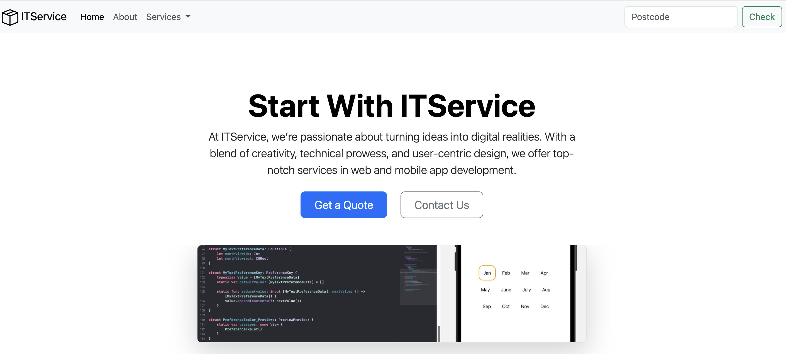

# Introduction

This is a simple IT service website created as a learning project using HTML and Bootstrap.

# Technologies Used

- HTML
- Bootstrap 5

# Quick Start

To get a local copy up and running, follow these steps:

1. Clone the repository:
```
git clone https://github.com/AaronYu728/myITService.git

```
  
2. Open index.html in your web browser to view the website.



